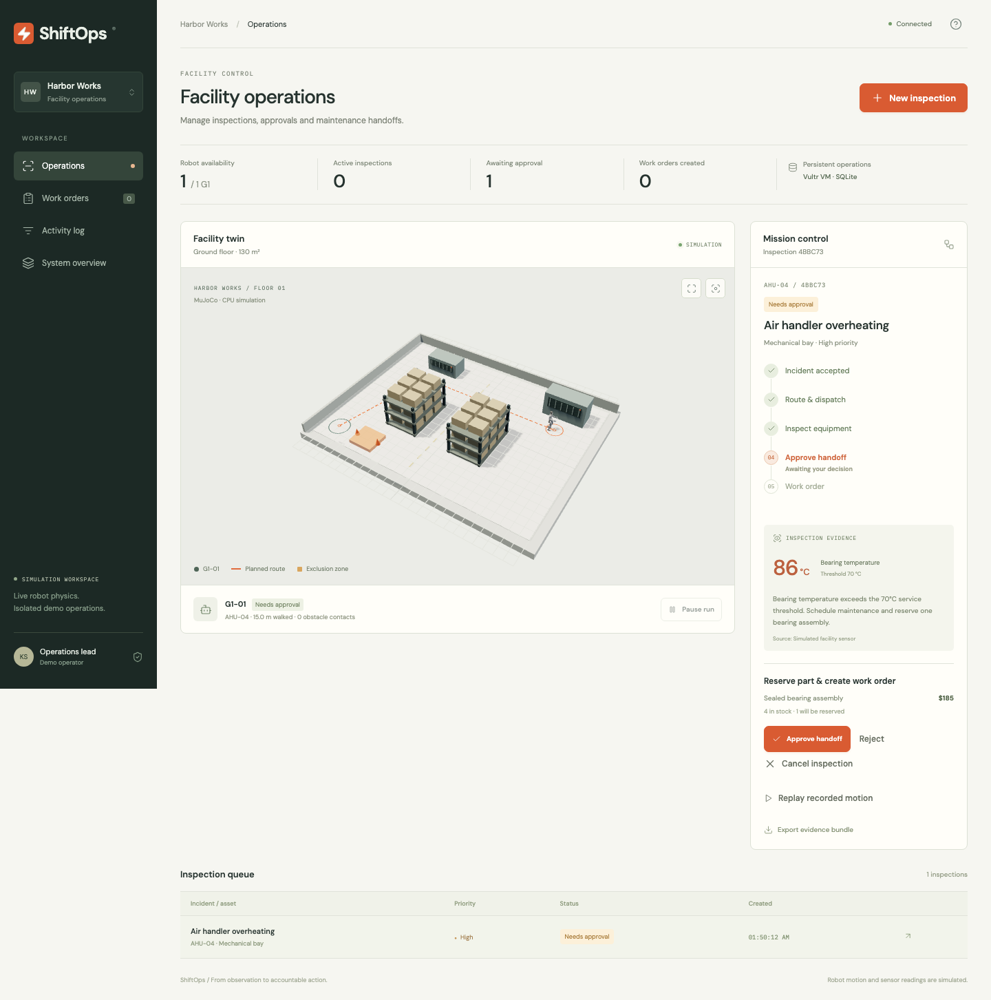
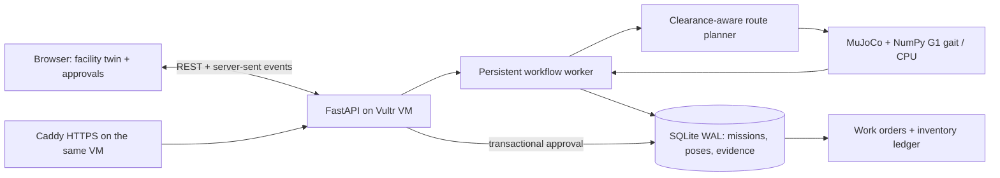

# ShiftOps

**Robot inspections that become accountable maintenance work.**

ShiftOps is a facility-operations web app for Vultr's Agent Arena Challenge 2.
A Unitree G1 navigates a CPU MuJoCo facility twin, inspects a simulated equipment
alert, checks inventory, and prepares a maintenance handoff. An operator reviews
the evidence before a work order and parts reservation are committed together.

[Open the live app](https://shiftops.104-156-229-254.sslip.io) · [Watch the public deployment demo](https://github.com/KaushikSiva/shiftops/releases/download/v1.0.0/shiftops-vultr-demo.mp4) · [Verified Linux CI](https://github.com/KaushikSiva/shiftops/actions/runs/36290083728)

**Live on Vultr:** a Silicon Valley CPU VM runs the web application, API, workflow,
MuJoCo and SQLite. Public HTTPS, all 16 browser checks, approval/stock accounting,
and persistence across two container restarts have been verified. See
[deployment evidence](docs/DEPLOYMENT.md) and the [submission package](docs/SUBMISSION.md).



## Run locally

Requires Python 3.12 and Node 22+.

```sh
uv venv .venv --python 3.12
uv pip install --python .venv/bin/python -r requirements.lock
cd web
npm ci
npm run build
cd ..
OPENBLAS_NUM_THREADS=1 OMP_NUM_THREADS=1 .venv/bin/uvicorn backend.app:app --host 127.0.0.1 --port 8197
```

Open http://127.0.0.1:8197. Click **New inspection**, leave the loading aisle
blocked, and dispatch the air-handler incident. Watch the robot take its route,
review the temperature observation, and approve the maintenance handoff. Inspect
the resulting work order and download its evidence. **Replay recorded motion**
shows the actual poses captured during that run.

The simulation runs faster than wall time; simulation time is shown separately.
You can pause, resume or cancel a mission. Cancellation retains the audit record
without reserving stock or creating a work order, and lets you dispatch another
inspection. A service restart pauses interrupted runs and retains their physics
checkpoints for explicit operator resume. Operator commands take precedence over
older physics work still in flight.

## What the application actually does

- Clearance-aware A* planning around shared facility collision geometry.
- Real CPU MuJoCo simulation with the existing frozen Unitree G1 LSTM gait.
- Server-owned mission state, robot telemetry, inspection evidence and work orders.
- Three scenarios: high bearing temperature, low pump pressure, and an out-of-stock filter.
- Inspection location must be reached before evidence and an approval proposal exist.
- A stability or obstacle-contact fault stops execution and escalates.
- An operator approval atomically creates a work order and reserves available stock.
- No-stock cases create a purchase **request**, not an external purchase.
- Idempotent intake/approval and isolated browser demo workspaces.
- SQLite WAL persistence, REST API, server-sent live updates and exported trajectory evidence.

Rule-based workflow orchestration is deliberate and permitted by the challenge.
The robot's learned gait is the AI component. No LLM, perception model, live
physical robot, actual repair or external enterprise connector is claimed.
Equipment readings are labeled simulated sensor observations, not inferred vision.

## Architecture



The VM is the system of record and execution/control plane. It is not merely a
static host. Browser 3D rendering requires WebGL; backend simulation requires no GPU.

## Vultr deployment

Use a Vultr Ubuntu VM with Docker Engine + Compose installed. Start with two CPU
cores and at least 2 GiB RAM. No GPU, managed database or inference service is required.

```sh
cp .env.example .env
# On the VM: set SITE_ADDRESS to your DNS hostname, SHIFTOPS_DEPLOYMENT=vultr.
docker compose up -d --build
docker compose ps
```

Caddy serves the public app on 80/443 and obtains HTTPS certificates for a DNS
hostname pointing to the VM. Restrict SSH to your IP. Only Caddy publishes a port;
the application and database are internal. SQLite lives in the `operations` named
volume. Do not run `docker compose down -v` unless intentionally deleting all data.

Alternatively, `bash scripts/deploy.sh user@vm` transfers this project and builds
it remotely using an existing authorized SSH connection. It never provisions paid
resources or reads cloud credentials.

Verify from outside the VM:

```sh
.venv/bin/python scripts/public-smoke.py https://YOUR-HOST --require-vultr
```

The provider label is deployment configuration, not proof of the cloud vendor.
Retain the Vultr instance ID and console evidence for the submission. Verify the
VM provider separately and run a container restart persistence check before judging.

## Validation

```sh
OPENBLAS_NUM_THREADS=1 OMP_NUM_THREADS=1 .venv/bin/python -m pytest -q
cd web && npm run build
# With the server running, install Playwright Chromium once if needed:
npx playwright install chromium
npm run test:e2e
```

Tests execute actual MuJoCo navigation for every scenario, then verify approvals,
inventory accounting, idempotency, isolation, cancellation, pause/resume races
and restart recovery.
Browser checks exercise intake, live movement, approval, work orders, replay and
mobile layout. Generated screenshots, videos and reports live in `artifacts/`.

To record the full public walkthrough, including the stockout exception:

```sh
SHIFTOPS_URL=https://shiftops.104-156-229-254.sslip.io node scripts/record-demo.mjs
```

The recording uses the actual browser and writes a scene timeline under
`artifacts/live-demo/`. It requires the frontend dependencies and Playwright
Chromium installed as above.

## Existing work and hackathon work

Reused from the author's **G1 Street Wise** project: the Unitree robot URDF/STLs,
the frozen locomotion-policy weights exported as NumPy arrays, and the NumPy LSTM
executor. Their reuse is disclosed, not presented as new model training.

New here: the enterprise operations workflow, SQLite approval/resource ledger,
facility route planner and scene, persistent physics/checkpoint worker, REST/SSE
API, operator interface, replay/export, tests and Vultr deployment package.

See [third-party notices](THIRD_PARTY_NOTICES.md), [demo script](docs/DEMO_SCRIPT.md),
[submission checklist](docs/SUBMISSION.md) and [build/evidence plan](docs/BUILD_PLAN.md).

## Demo boundaries

This is a hackathon demonstration with isolated anonymous workspaces, not an
enterprise identity/RBAC system. Keep data fictional. Run one Uvicorn worker:
the worker owns its physics instances; scaling to multiple worker processes
requires a queue/lease coordinator. A maximum of four runs execute concurrently,
with 30 runs per browser workspace and 2,000 workspaces per demo deployment.
Use a dedicated VM and back up its operations volume. Real hardware remains
disconnected; no robot-network or actuator command interface is included.
